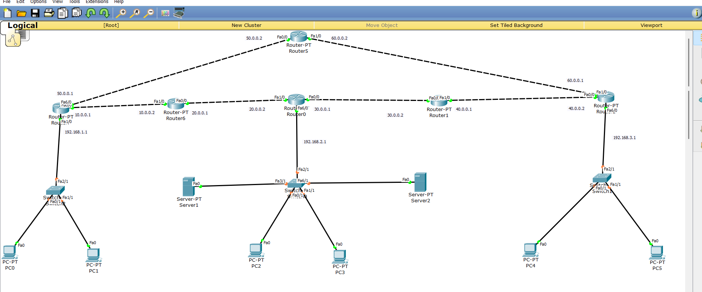

# 📡 Cisco Packet Tracer Project – Enterprise Network Simulation

## 📌 Project Overview

This project demonstrates the design and implementation of a **multi-router enterprise network** using Cisco Packet Tracer. The network is configured to simulate real-world networking concepts including routing, remote access, IP management, and redundancy.

The objective of this project is to build a **reliable, scalable, and secure network infrastructure** for a university/lab environment using only routers and end devices.

---

## 🏗️ Network Topology

* Total Routers: **6 (Router0 – Router5)**
* Areas:

  * **Area 0 (Backbone):** Router0, Router1, Router2
  * **Area 1:** Router3, Router4
* **Router5** acts as a **Backup Router** connecting all routers
* End devices (PCs) connected for testing

---

## ⚙️ Protocols & Technologies Used

### 🔹 1. OSPF (Open Shortest Path First)

* Implemented for dynamic routing
* Multi-area OSPF configuration:

  * Area 0 (Backbone)
  * Area 1
* Ensures efficient route calculation and fast convergence

---

### 🔹 2. DHCP (Dynamic Host Configuration Protocol)

* Automatic IP address assignment to clients
* Eliminates manual IP configuration
* Configured on routers

---

### 🔹 3. DNS (Domain Name System)

* Configured **without a dedicated DNS server**
* Enables hostname resolution within the network

---

### 🔹 4. SSH (Secure Shell)

* Secure remote access to routers
* Encrypted communication
* Used for safe administration

---

### 🔹 5. Telnet

* Remote access protocol (less secure than SSH)
* Implemented for learning and comparison purposes

---

### 🔹 6. Backup Router (Failover Mechanism)

* Router5 acts as a backup path
* Provides redundancy in case of link/router failure
* Improves network reliability

---

### 🔹 7. CDP (Cisco Discovery Protocol)

* Used to discover directly connected Cisco devices
* Helps in network troubleshooting

---

### 🔹 8. Traceroute

* Used to trace the path of packets
* Helps in diagnosing routing issues

---

## 🔐 Security Features

* SSH implemented for secure login
* Basic password protection on routers
* Controlled remote access

---

## 🎯 Project Objectives

* Design a scalable enterprise network
* Implement dynamic routing using OSPF
* Automate IP assignment using DHCP
* Enable secure remote access (SSH)
* Provide redundancy using a backup router
* Simulate real-world networking environment

---

## 🧪 Testing & Verification

* Successful ping between all devices
* OSPF neighbor relationships verified
* DHCP IP allocation checked
* SSH and Telnet remote login tested
* Traceroute used for path verification
  

## 📸 Network Topology

## 📊 Key Learning Outcomes

* Practical understanding of OSPF multi-area configuration
* Hands-on experience with DHCP and DNS
* Difference between SSH and Telnet
* Network redundancy and failover concepts
* Troubleshooting using CDP and Traceroute

---

## 🚀 Future Improvements

* Add VLAN configuration
* Implement ACL (Access Control Lists)
* Introduce firewall/security policies
* Add real DNS server
* Integrate cloud or internet simulation

---

## 👨‍💻 Author

**Purav Sachdeva**

---

## 📎 Note

This project is created for educational purposes using Cisco Packet Tracer and demonstrates core networking concepts used in real-world environments.

